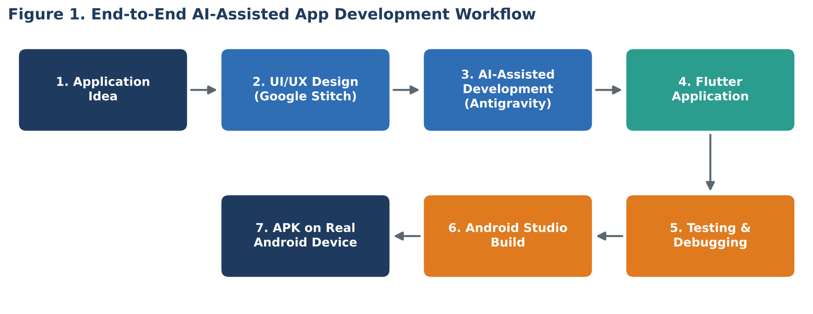
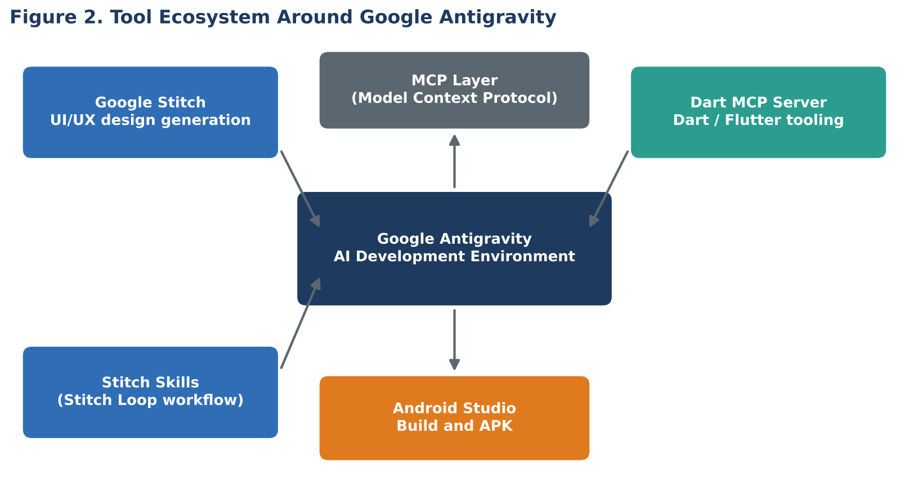
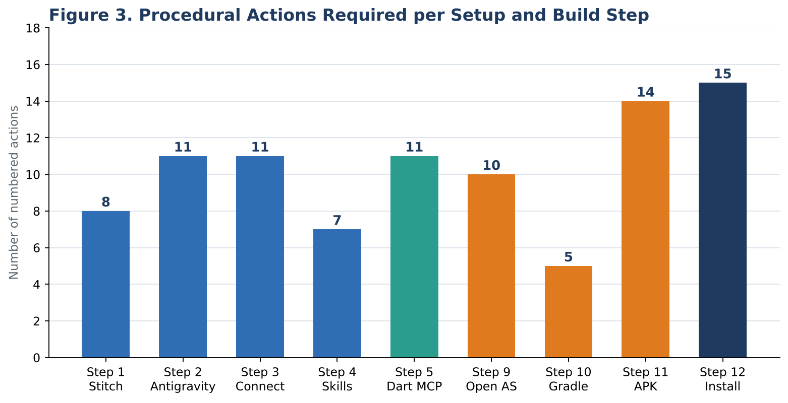
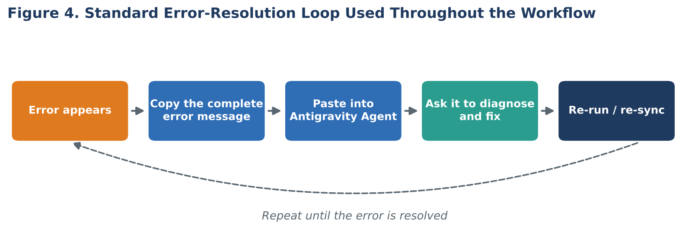

# Mobile App Development

## AI-Assisted Application Development Using Google Stitch, Antigravity, Flutter and Android Studio

| | |
|---|---|
| **Document type** | Seminar handout and practical guide |
| **Subject area** | Mobile Application Development |
| **Target platform** | Android (Flutter / Dart) |
| **Level** | Undergraduate |
| **Output** | Working Android APK installed on a physical device |

---

## Table of Contents

1. [Introduction](#1-introduction)
2. [Learning Outcomes](#2-learning-outcomes)
3. [Application Development Workflow](#3-application-development-workflow)
4. [Tools and Technologies](#4-tools-and-technologies)
5. [Environment Setup (Steps 1 to 5)](#5-environment-setup-steps-1-to-5)
6. [Building the Application (Steps 6 to 8)](#6-building-the-application-steps-6-to-8)
7. [Android Studio and APK Generation (Steps 9 to 11)](#7-android-studio-and-apk-generation-steps-9-to-11)
8. [Installing the APK on a Device (Step 12)](#8-installing-the-apk-on-a-device-step-12)
9. [Troubleshooting Method](#9-troubleshooting-method)
10. [Summary and Quick Reference](#10-summary-and-quick-reference)

---

## 1. Introduction

AI-assisted app development is a modern approach to software development in which Artificial Intelligence tools assist developers in designing, generating, integrating, testing, and improving applications.

Instead of writing every part of an application manually, developers use AI-powered tools to generate user interface designs, source code, project structures, API integrations, and development guidance. The developer remains responsible for:

- Defining the requirements.
- Reviewing the generated output.
- Testing the application.
- Making the necessary corrections.

This seminar follows one complete application-development workflow, from an initial idea to an application running on a real mobile device.

---

## 2. Learning Outcomes

After completing this seminar, students will be able to:

| No. | Learning outcome |
|:---:|---|
| 1 | Explain the AI-assisted app development workflow. |
| 2 | Convert an application idea into a structured UI/UX design. |
| 3 | Use AI tools to assist with application development and code generation. |
| 4 | Describe the role of Flutter and Dart in mobile development. |
| 5 | Test the application during development. |
| 6 | Build an Android APK using Android Studio. |
| 7 | Install and test the application on a real Android device. |

---

## 3. Application Development Workflow

AI-assisted app development follows a structured process that takes an application from idea to a working mobile application.



The table below maps each workflow stage to its purpose and the tool used.

| Stage | Activity | Tool or technology | Result |
|:---:|---|---|---|
| 1 | Application idea | Developer | Defined requirements and screen list |
| 2 | UI/UX design | Google Stitch | Multi-screen interface design |
| 3 | AI-assisted development | Google Antigravity | Generated project and source code |
| 4 | Flutter application | Flutter and Dart | Runnable cross-platform application |
| 5 | Testing and debugging | Antigravity, local browser | Verified navigation and behaviour |
| 6 | Build | Android Studio | Generated APK file |
| 7 | Deployment | Real Android device | Installed and tested application |

---

## 4. Tools and Technologies

| Tool | Category | Purpose |
|---|---|---|
| **Google Stitch** | UI/UX design | Creates and generates UI/UX designs. |
| **MCP (Model Context Protocol)** | Integration standard | Connects AI development tools with external services. |
| **Antigravity** | AI development environment | Provides AI-assisted application development. |
| **Stitch Skills** | Capability extension | Provides specialised capabilities for working with Stitch. |
| **Flutter** | Framework | Builds cross-platform mobile applications. |
| **Dart** | Programming language | Language used to develop Flutter applications. |
| **Android Studio** | Build tool | Builds, tests, and generates Android APKs. |



### 4.1 Model Context Protocol (MCP)

MCP stands for Model Context Protocol. It is an open standard that allows AI applications to connect with external tools, services, data sources, and applications in a structured way.

In simple terms, MCP acts as a bridge between an AI model and external tools. It allows the AI to use those tools instead of working only with the information stored inside the AI model itself.

### 4.2 Stitch Loop

Stitch Loop is a workflow, delivered as a skill, that helps you work with multiple application screens using Stitch and the AI development environment. Instead of creating each screen completely separately, the Stitch workflow helps maintain consistency across the screens of the application.

---

## 5. Environment Setup (Steps 1 to 5)

The following graph shows the number of numbered actions required in each procedural step of this guide. Steps 6 to 8 are prompt-based and are therefore not included.



### Step 1: Set Up Google Stitch

The API key allows Antigravity to connect to Google Stitch, so that Antigravity can work with the Stitch-generated designs during development.

**Procedure**

1. Open Google Stitch and sign in with your Google account.
2. Click the profile icon in the top-right corner.
3. Select **Stitch Settings**.
4. Scroll down to the **API/Developer** section.
5. Find **API Key** or **Google API Key**.
6. Click **Create Key**. A new API key is generated.
7. Click **Copy** to copy the key.

> **Important:** Keep your API key confidential. Do not share it publicly, post it on GitHub, or include it directly in your source code.

### Step 2: Download and Set Up Google Antigravity

Antigravity is the AI-powered development environment used to build the application.

1. Open your web browser.
2. Search for Google Antigravity and open the official website.
3. Click **Download**.
4. Download the version suitable for your operating system.
5. Install Antigravity on your computer.
6. Open Google Antigravity.
7. Click **Sign in / Log in**.
8. Sign in using your Google account.
9. Use the Google account that has access to your Gemini plan or credits, if applicable.
10. Complete the initial setup and allow the required permissions.
11. When setup is complete, the Antigravity development workspace is displayed.

### Step 3: Connect Google Stitch with Antigravity

Connect Stitch to Antigravity using the API key generated in Step 1.

1. Open Google Antigravity.
2. Create or open your project folder (example: `AI-App-Project`).
3. Open **Settings**.
4. Go to **Customization**, or find **Installed MCP Servers**.
5. Click **+ Add MCP Server**.
6. In the search box, type `Stitch`.
7. Select the **Google Stitch MCP Server** from the results.
8. Antigravity loads the Stitch MCP configuration.
9. When prompted for the API key, paste the key generated in Step 1.
10. Save or confirm the configuration.
11. Check that Stitch appears under **Installed MCP Servers** and is connected and enabled.

### Step 4: Install Google Stitch Skills

Stitch Skills give Antigravity additional instructions and capabilities for working with Google Stitch, including creating and managing Stitch-based UI designs.

1. Open Google Antigravity.
2. Open your project.
3. In the Antigravity chat or agent area, enter the following instruction:

```text
Install the Google Stitch skills from GitHub so I can use the Stitch Loop skill to build multi-screen apps.
```

4. Antigravity locates the required Google Stitch Skills on GitHub.
5. Allow Antigravity to install and configure the skills.
6. Wait until the installation completes successfully.
7. Verify that the Stitch Loop skill is available.

### Step 5: Install the Dart / Flutter MCP

The Dart MCP server helps Antigravity work with the Dart and Flutter development environment while building the application.

1. Open Google Antigravity.
2. Open your project.
3. Go to **Settings**.
4. Open **Customization**.
5. Find **MCP Servers**.
6. Click **Install MCP** or **+ Add MCP**.
7. In the search box, type `Dart`.
8. Find the **Dart MCP Server**.
9. Click **Install**.
10. Wait for the installation to finish.
11. Confirm that the Dart MCP is shown as **Installed / Enabled**.

**If an error occurs**

1. Do not ignore the error.
2. Copy the complete error message.
3. Return to the Antigravity chat or agent area.
4. Paste the error there.
5. Ask Antigravity to diagnose and fix the error.
6. Follow the suggested fix.
7. Try the Dart MCP installation again.
8. Repeat until the installation is successful.

Suggested prompt:

```text
I am trying to install the Dart MCP for my Flutter project, but I received the following error. Analyse the error, identify the cause, fix the issue, and then help me install the Dart MCP successfully.
```

> **Note:** After completing all setup steps, restart Google Antigravity so that the newly installed MCP servers and Stitch skills are loaded correctly.

---

## 6. Building the Application (Steps 6 to 8)

### Step 6: Build Your First App with Antigravity

With Stitch, MCP, Stitch Skills, and Dart/Flutter configured, an app-building prompt can be given to Antigravity. Two prompts are used in this session.

| Prompt | Purpose |
|---|---|
| Prompt 1: Live demonstration | A real example (CookSmart) is built together. |
| Prompt 2: Student practice | Students replace the example with their own app idea. |

#### 6.1 Live Demonstration: CookSmart App

Copy and paste this prompt into the **Antigravity chat/agent area**:

```text
Can you build me a four-screen mobile app called "CookSmart" using the Stitch Loop skill?

Screen 1: Create a home screen with featured recipes, food categories, and a search bar.

Screen 2: Create an ingredient input screen where users can enter the ingredients they have and search for recipes based on those ingredients.

Screen 3: Create a recipe result screen showing the recipe name, ingredients, preparation time, instructions, and a Save Recipe button.

Screen 4: Create a saved recipes screen where users can view their saved recipes.

Use a dark background with warm orange accents and clean white typography. Make the UI modern, responsive, and mobile-friendly. Keep navigation simple and consistent between all four screens.

Use Flutter and Dart to implement the application. Use the Stitch Loop skill to create and maintain the multi-screen design. Build the complete project and make sure it can run successfully.
```

The CookSmart screen specification is summarised below.

| Screen | Name | Key content |
|:---:|---|---|
| 1 | Home | Featured recipes, food categories, search bar |
| 2 | Ingredient input | Ingredient entry and recipe search by ingredients |
| 3 | Recipe result | Name, ingredients, preparation time, instructions, Save Recipe button |
| 4 | Saved recipes | List of recipes saved by the user |

| Design attribute | Specification |
|---|---|
| Background | Dark |
| Accent colour | Warm orange |
| Typography | Clean white |
| Quality requirements | Modern, responsive, mobile-friendly, consistent navigation |

#### 6.2 Student Practice: Build Your Own App

After the demonstration, students create their own application by replacing the CookSmart idea. Use the following template:

```text
Can you build me a [NUMBER]-screen mobile app called "[APP NAME]" using the Stitch Loop skill?

Screen 1: Create a [HOME/DASHBOARD] screen with [FEATURES].

Screen 2: Create a [SCREEN NAME] where users can [ACTION].

Screen 3: Create a [SCREEN NAME] showing [INFORMATION/FEATURES].

Screen 4: Create a [SCREEN NAME] where users can [ACTION].

Use a [DESCRIBE YOUR DESIGN STYLE]. Make the UI modern, responsive, and mobile-friendly. Keep navigation simple and consistent between all screens.

Use Flutter and Dart to implement the application. Use the Stitch Loop skill to create and maintain the multi-screen design. Build the complete project and make sure it can run successfully.
```

### Step 7: Run and Test the App

Once Antigravity has built the application, ask it to run the Flutter app locally and verify that everything works correctly. Copy and paste this prompt into the Antigravity chat/agent:

```text
Hey, can you take this mobile app design and turn it into a working Flutter application? Make sure the navigation works correctly between all screens and matches the design exactly. Then run it locally so I can test it.

Please:
- Convert the current design into a functional Flutter application.
- Make sure all screens are properly connected.
- Make sure navigation between screens works correctly.
- Keep the UI as close as possible to the approved design.
- Check for Flutter/Dart errors and fix them.
- Run the application locally.
- Make sure the app is ready for testing.
```

**Open and test the app in the browser**

After Antigravity runs the application successfully, it provides a local URL, for example:

```text
http://localhost:8080
```

**If an error appears:** do not try to solve it manually at first. Copy the complete error, paste it into the Antigravity Agent, ask it to diagnose and fix the error, and run the app again.

### Step 8: Prepare the Flutter App for Android Studio

After testing in the browser, prepare the Flutter project for Android Studio so that it can be converted into an Android APK.

#### 8.1 Live Demonstration: CookSmart

Paste this prompt into the Antigravity chat/agent:

```text
Prepare the CookSmart Flutter project for Android Studio and make sure it is ready to build as an Android APK.

Please:
- Check the complete Flutter project structure.
- Make sure all required dependencies are properly configured.
- Check and fix any Dart or Flutter errors.
- Configure the Android project correctly.
- Check that there are no missing packages, files, or configuration issues.
- Run Flutter analysis and fix any errors or warnings that could prevent the app from building.
- Clean the project and fetch all required dependencies.
- Verify that the project is ready to open and build in Android Studio.
- Do not change the existing UI or functionality unnecessarily.

Finally, confirm that the project is ready to build an Android APK.
```

#### 8.2 Student Practice Template

Students replace the app-specific information with their own project.

```text
Prepare my [APP NAME] Flutter project for Android Studio and make sure it is ready to build as an Android APK.

Please:
- Check the complete Flutter project structure.
- Make sure all required dependencies are properly configured.
- Check and fix any Dart or Flutter errors.
- Configure the Android project correctly.
- Check for missing packages, files, or configuration issues.
- Run Flutter analysis and fix errors that could prevent the app from building.
- Clean the project and fetch all required dependencies.
- Verify that the project is ready to open and build in Android Studio.
- Do not change my existing UI or functionality unnecessarily.
```

> **Important:** If Antigravity reports an error, copy the complete error message and paste it back into the Agent with this prompt:

```text
I received this error while preparing the Flutter project for Android Studio. Analyze the error, fix the root cause, and verify the project again.
```

On success, Antigravity reports a message similar to the following:

> The project is now fully configured and all required dependencies are in place. You can directly open the Android folder (or the root folder) in Android Studio to continue your development or build the Android APK.

---

## 7. Android Studio and APK Generation (Steps 9 to 11)

### Step 9: Open the Flutter Project in Android Studio

1. Download and install Android Studio from the official Android Studio website.
2. Open Android Studio.
3. On the welcome screen, select **Open**.
4. Navigate to the Flutter project folder created by Antigravity.
5. Select the project folder and click **OK / Open**.
6. Wait for Android Studio to load the project and complete Gradle synchronisation.
7. Inside the project, locate the `android` folder.
8. Open or select the `android` folder for the Android-specific project configuration.
9. Allow Android Studio to download or configure any required dependencies if prompted.
10. Wait until the project finishes syncing without errors.

**Flutter project structure**

```text
Your Flutter Project
|
|-- lib/              Dart source code
|-- assets/           Images, fonts and other resources
|-- pubspec.yaml      Project dependencies and configuration
|
`-- android/          Open and use this folder for Android Studio
    |-- app/
    |-- gradle/
    `-- ...
```

| Folder or file | Role |
|---|---|
| `lib/` | Contains the Dart source code of the application. |
| `assets/` | Contains images, fonts, and other static resources. |
| `pubspec.yaml` | Declares dependencies, assets, and project metadata. |
| `android/` | Contains the Android-specific project used by Android Studio. |

### Step 10: Wait for Android Studio to Finish Loading

After opening the project, a process such as "Importing 'android' Gradle Project" or "Gradle: Downloading..." may be displayed.

1. Wait while Android Studio imports the Android project.
2. Allow Gradle to download and configure the required dependencies.
3. Do not close Android Studio during this process.
4. Do not interrupt the Gradle sync unless it is clearly stuck or has failed.
5. Once the process finishes, check that the project loads without errors.

**If an error appears**

If Android Studio shows a red error, Gradle error, dependency error, or configuration error:

1. Copy the complete error message.
2. Return to the Antigravity chat/agent.
3. Paste the error.
4. Ask Antigravity to analyse and fix it.

Use this prompt:

```text
Android Studio is showing the following error while importing/syncing the Android project. Please analyze the error, identify the root cause, fix the project configuration, and make sure the Flutter project can be opened and built successfully in Android Studio.

Error:
[PASTE THE COMPLETE ERROR HERE]
```

After Antigravity fixes the issue, return to Android Studio and sync or reload the project again.

### Step 11: Generate the Android APK

Once the Gradle sync has finished successfully, generate the final Android APK.

1. Wait until Android Studio shows that the Gradle sync is complete.
2. Go to the top menu in Android Studio.
3. Click **Build**.
4. Select **Generate App Bundles or APKs**.
5. Click **Generate APKs**.
6. Android Studio starts the compile and build process.
7. Wait until the process finishes.
8. Do not close Android Studio while the APK is being generated.
9. When the build succeeds, a message such as "APK(s) generated successfully" is displayed.
10. Click **Locate** in that message.
11. Android Studio opens the folder containing the generated APK.
12. Find the `.apk` file.
13. Copy the APK.
14. Paste it somewhere convenient, such as the Desktop.

---

## 8. Installing the APK on a Device (Step 12)

### Step 12: Transfer and Install the APK on a Mobile Device

1. Locate the generated `.apk` file on your computer.
2. Connect your Android phone to the computer using a USB cable.
3. Unlock your phone.
4. Select **File Transfer** when the USB notification appears.
5. Open the phone storage from the computer.
6. Copy the `.apk` file from your computer.
7. Paste it into the phone's **Downloads** folder.
8. Safely disconnect the phone from the computer.
9. Open **Files / File Manager** on the phone.
10. Go to **Downloads**.
11. Tap the `.apk` file.
12. If Android asks for permission to install apps from that source, allow it.
13. Tap **Install**.
14. Wait for the installation to complete.
15. Tap **Open** to launch the application.

**Alternative transfer methods**

| Method | Description | Suitability |
|---|---|---|
| USB cable | Copy the APK directly to the phone. | Recommended for a simple development workflow |
| Google Drive | Upload on the computer, download on the phone. | Useful when no cable is available |
| WhatsApp | Send the APK to yourself. | Quick, but depends on the messaging service |
| Quick Share | Share directly between nearby devices. | Useful for wireless transfer |

### Final Step: Install and Run Your App

1. Find the generated `.apk` file on your computer.
2. Transfer the APK to your Android phone using USB, Quick Share, Google Drive, WhatsApp, or another method.
3. Open the APK on your phone.
4. Allow **Install unknown apps** if Android asks for permission.
5. Tap **Install**.
6. Wait for the installation to complete.
7. Tap **Open** and launch your application.
8. Test all screens, buttons, navigation, and features.

---

## 9. Troubleshooting Method

Throughout this workflow, errors are handled with the same method: the complete error message is passed back to the AI agent, which diagnoses and fixes it.



| Where the error occurs | Action |
|---|---|
| Dart MCP installation (Step 5) | Paste the error into Antigravity and ask for a diagnosis and fix, then reinstall. |
| Running the app locally (Step 7) | Paste the full error into the Agent and run the app again. |
| Preparing the project (Step 8) | Use the Step 8 error prompt, then verify the project again. |
| Gradle or import errors (Step 10) | Use the Step 10 prompt, then sync or reload in Android Studio. |

---

## 10. Summary and Quick Reference

| Step | Task | Where |
|:---:|---|---|
| 1 | Create and copy the Stitch API key | Google Stitch |
| 2 | Install and sign in to Antigravity | Antigravity |
| 3 | Add the Stitch MCP server using the API key | Antigravity |
| 4 | Install Stitch Skills (Stitch Loop) | Antigravity |
| 5 | Install the Dart MCP and restart Antigravity | Antigravity |
| 6 | Build the app with the Stitch Loop prompt | Antigravity |
| 7 | Run the app locally and test in the browser | Antigravity, browser |
| 8 | Prepare the project for Android Studio | Antigravity |
| 9 | Open the project and sync Gradle | Android Studio |
| 10 | Wait for Gradle import to finish | Android Studio |
| 11 | Build, Generate App Bundles or APKs, Generate APKs | Android Studio |
| 12 | Transfer and install the APK | Android device |

**Key points**

- The developer defines requirements, reviews output, and tests; the AI tools generate and assist.
- MCP connects the AI environment to external tools such as Stitch and Dart.
- Stitch Loop keeps multiple screens consistent.
- Keep API keys confidential and out of source code and public repositories.
- When any error occurs, pass the complete error message back to the AI agent.
